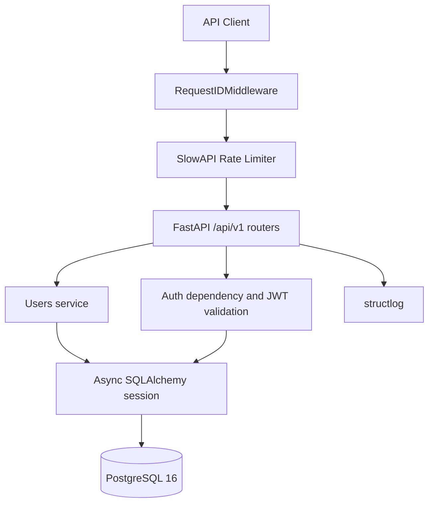
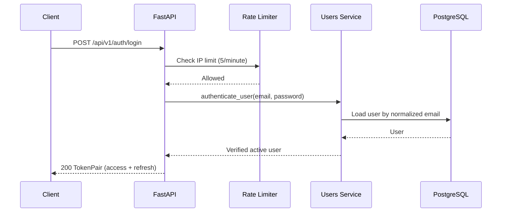
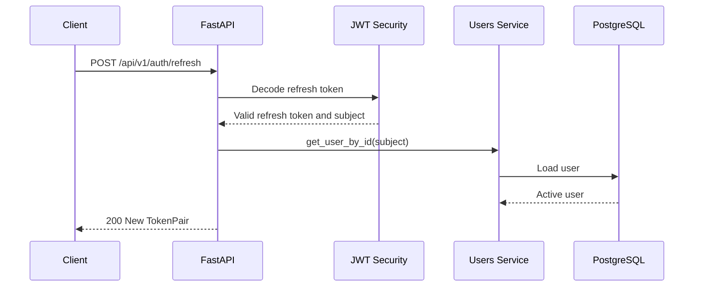

# FELAGI CRM

> **A production-minded backend foundation for a small-business CRM — built with FastAPI, async SQLAlchemy, PostgreSQL, and JWT authentication.**

[](https://www.python.org/)
[](https://fastapi.tiangolo.com/)
[](https://www.postgresql.org/)
[](https://www.sqlalchemy.org/)
[](#-testing)
[](#-testing)

## ✨ Features

- **Async REST API** — FastAPI with SQLAlchemy 2.0 async sessions and PostgreSQL 16.
- **Health checks** — `GET /api/v1/health` verifies database connectivity.
- **User authentication** — registration, login, refresh, and current-user endpoints.
- **JWT token pairs** — signed access and refresh tokens with explicit `token_type` claims.
- **Secure passwords** — Argon2 hashing through `pwdlib`.
- **Rate limiting** — registration and login are limited to 5 requests per minute per IP.
- **Request tracing** — every response carries an `X-Request-ID`; structured request logs are emitted with `structlog`.
- **Database migrations** — Alembic manages the schema, starting with the `users` table.
- **Tested backend** — 24 unit and integration tests, 82% coverage.

## 🏗️ Architecture



The backend uses a vertical module structure: each domain module owns its SQLAlchemy model, Pydantic schemas, service functions, and router. Shared concerns such as configuration, security, logging, database sessions, and middleware live in `app/core` and `app/db`.

## 🔄 Request Flow

### Login



### Refresh



## 🛠️ Tech Stack

| Area | Technology |
| --- | --- |
| Language | [Python 3.13](https://www.python.org/) |
| API | [FastAPI](https://fastapi.tiangolo.com/) |
| Validation | [Pydantic v2](https://docs.pydantic.dev/) and [pydantic-settings](https://docs.pydantic.dev/latest/concepts/pydantic_settings/) |
| ORM | [SQLAlchemy 2.0](https://www.sqlalchemy.org/) async |
| Database | [PostgreSQL 16](https://www.postgresql.org/) with [asyncpg](https://magicstack.github.io/asyncpg/) |
| Migrations | [Alembic](https://alembic.sqlalchemy.org/) |
| Authentication | [PyJWT](https://pyjwt.readthedocs.io/) and [pwdlib](https://frankie567.github.io/pwdlib/) with Argon2 |
| Rate limiting | [SlowAPI](https://slowapi.readthedocs.io/) |
| Logging | [structlog](https://www.structlog.org/) |
| Testing | [pytest](https://docs.pytest.org/), [pytest-asyncio](https://pytest-asyncio.readthedocs.io/), [Testcontainers](https://testcontainers.com/), [httpx](https://www.python-httpx.org/) |
| Tooling | [uv](https://docs.astral.sh/uv/), [Ruff](https://docs.astral.sh/ruff/), [mypy](https://www.mypy-lang.org/) |
| Infrastructure | [Docker](https://www.docker.com/) and Docker Compose |

## 📁 Project Structure

```text
app/
├── api/
│   ├── dependencies/       # Authentication dependencies
│   └── v1/                 # API v1 router and health endpoint
├── core/                   # Settings, JWT, logging, middleware, rate limits
├── db/                     # Declarative Base, async engine, session dependency
├── modules/
│   └── users/              # User model, schemas, service, auth/users routers
├── factory.py              # FastAPI app factory and middleware registration
└── main.py                 # ASGI entry point

alembic/
├── env.py                  # Async Alembic configuration
└── versions/               # Schema migrations

tests/
├── unit/                   # Password and JWT helper tests
├── integration/            # Auth API tests against Testcontainers PostgreSQL
└── conftest.py             # Database, app, client, and cleanup fixtures
```

## 🚀 Quick Start

### Docker

1. Copy `.env.example` to `.env` and set local secrets:

   ```text
   POSTGRES_PASSWORD=devpass
   JWT_SECRET_KEY=dev-secret-key-at-least-32-characters
   ```

2. Start the API and PostgreSQL:

   ```text
   docker compose up --build
   ```

3. Check the service:

   ```text
   curl http://localhost:8000/api/v1/health
   ```

   Expected response:

   ```json
   {"status":"ok","database":"ok"}
   ```

4. Stop services and remove the database volume:

   ```text
   docker compose down -v
   ```

### Without Docker

1. Install dependencies:

   ```text
   uv sync
   ```

2. Create `.env` with a local PostgreSQL configuration and JWT secret.
3. Start PostgreSQL 16.
4. Start the API:

   ```text
   uv run uvicorn app.main:app --reload
   ```

5. Visit `http://localhost:8000/api/v1/health`.

## 📚 API Endpoints

### System

| Method | Endpoint | Description | Authentication |
| --- | --- | --- | --- |
| `GET` | `/api/v1/health` | Database health check | No |

### Authentication

| Method | Endpoint | Description | Authentication |
| --- | --- | --- | --- |
| `POST` | `/api/v1/auth/register` | Register a user | No |
| `POST` | `/api/v1/auth/login` | Get an access/refresh token pair | No |
| `POST` | `/api/v1/auth/refresh` | Get a new token pair from a refresh token | No |

### Users

| Method | Endpoint | Description | Authentication |
| --- | --- | --- | --- |
| `GET` | `/api/v1/users/me` | Get the current user | Bearer access token |

### Request and response examples

Register:

```json
{
  "email": "user@example.com",
  "password": "StrongPassword123"
}
```

The password must be 12–128 characters and contain a lowercase letter, an uppercase letter, and a digit. A successful registration returns `201 Created` with `UserRead`:

```json
{
  "id": "uuid",
  "email": "user@example.com",
  "role": "user",
  "is_active": true,
  "created_at": "2026-01-01T00:00:00Z"
}
```

Login returns `200 OK` with a token pair:

```json
{
  "access_token": "<jwt>",
  "refresh_token": "<jwt>",
  "token_type": "bearer"
}
```

`GET /api/v1/users/me` requires:

```text
Authorization: Bearer <access_token>
```

## 🔐 Auth & Authorization

### JWT tokens

| Token | Default TTL | Purpose |
| --- | --- | --- |
| Access | 15 minutes (`JWT_ACCESS_TOKEN_EXPIRE_MINUTES`) | Authenticate protected API requests |
| Refresh | 7 days (`JWT_REFRESH_TOKEN_EXPIRE_DAYS`) | Request a new access/refresh pair |

Both token types are signed JWTs and include a `token_type` claim. Access tokens cannot be used at refresh endpoints; refresh tokens cannot be used as Bearer credentials.

`POST /auth/refresh` returns a new access/refresh pair. This is JWT-only, non-revoking rotation: the prior refresh token remains valid until expiry because no server-side refresh-token store exists yet.

### Rate limiting

`POST /auth/register` and `POST /auth/login` allow **5 requests per minute per IP**. Exceeding the limit returns `429 Too Many Requests`.

### Roles

| Role | Current state |
| --- | --- |
| `admin` | Stored on users; RBAC enforcement planned for Stage 3 |
| `manager` | Stored on users; RBAC enforcement planned for Stage 3 |
| `user` | Default role; RBAC enforcement planned for Stage 3 |

## 🧪 Testing

```text
uv run python -m pytest tests/ -q
```

| Suite | Coverage |
| --- | --- |
| Unit | Argon2 hashing and JWT creation, expiry, tampering, and token-type validation |
| Integration | Registration, login, refresh, `/users/me`, inactive users, duplicate emails, and rate limiting |

Integration tests use `Testcontainers` to run real PostgreSQL 16 and `httpx.AsyncClient` to exercise the ASGI application. The current suite has **24 passing tests** and **82% coverage** through `pytest-cov`.

Additional quality checks:

```text
uv run python -m ruff check .
uv run python -m ruff format --check .
uv run python -m mypy app
```

## 🧠 Design Decisions

### UUID instead of integer IDs

UUIDs do not expose registration order or user count in public API responses, work naturally in distributed environments, and are generated in the application with `uuid4` without a PostgreSQL extension.

### `str` + `CHECK` instead of a PostgreSQL enum for roles

Roles are stored as a short string and constrained to `admin`, `manager`, and `user` with a database `CHECK`. The API remains strict with a Pydantic `Literal`, while adding future roles avoids PostgreSQL enum-type management.

### Lowercase normalization + `CHECK` instead of `citext` for email

Email is normalized to lowercase at the API boundary and constrained by `email = lower(email)` in PostgreSQL. A normal unique index then protects case-insensitive uniqueness without requiring the `citext` extension.

### `HTTPBearer` instead of `OAuth2PasswordBearer`

Login accepts a JSON request body rather than OAuth2 password-form data, and the current API does not use OAuth2 scopes. `HTTPBearer` describes the actual request contract and documents Bearer authentication in OpenAPI.

### JWT-only refresh rotation

Refresh returns a new pair for a consistent client flow, but previous refresh tokens are not revoked. Without a refresh-token table or another server-side store, revocation cannot be reliable; that state is intentionally deferred until it is needed.

### Testcontainers instead of database mocks

Integration tests exercise PostgreSQL constraints, Alembic migrations, async SQLAlchemy, and HTTP routing against a real disposable database. This covers failures that database mocks would miss.

### `token_type` claims in JWTs

Explicit `access` and `refresh` token types prevent accidental token substitution: refresh credentials are rejected by protected endpoints, while access tokens are rejected by `/auth/refresh`.

## 🗺️ Roadmap

- ✅ **Stage 1:** Project skeleton, Docker, database health checks, quality tooling
- ✅ **Stage 2:** Users, JWT authentication, rate limiting, and tests
- ⬜ **Stage 3:** Clients, deals, tasks, and role-based access control
- ⬜ **Stage 4:** Search, filtering, pagination, and business workflows
- ⬜ **Stage 5:** Frontend application and API integration
- ⬜ **Stage 6:** Deployment, observability, screenshots, and portfolio polish

## 🌍 Environment Variables

| Variable | Required | Default | Description |
| --- | --- | --- | --- |
| `JWT_SECRET_KEY` | Yes | — | JWT signing key; use at least 32 characters |
| `JWT_ACCESS_TOKEN_EXPIRE_MINUTES` | No | `15` | Access token lifetime in minutes |
| `JWT_REFRESH_TOKEN_EXPIRE_DAYS` | No | `7` | Refresh token lifetime in days |
| `POSTGRES_SSL` | No | `false` | Use `false` locally and `true` for Render/Neon |
| `DATABASE_URL` | Conditional | — | Full async PostgreSQL URL; overrides individual `POSTGRES_*` values |
| `POSTGRES_DB` | No | `felagi_crm` | PostgreSQL database name |
| `POSTGRES_USER` | No | `felagi_crm` | PostgreSQL user |
| `POSTGRES_PASSWORD` | Conditional | — | Required unless `DATABASE_URL` is supplied |
| `POSTGRES_HOST` | No | `localhost` | PostgreSQL host |
| `POSTGRES_PORT` | No | `5432` | PostgreSQL port |
| `ENVIRONMENT` | No | `dev` | `dev`, `staging`, or `prod` |
| `DEBUG` | No | `false` | Enable SQLAlchemy debug logging |
| `LOG_LEVEL` | No | `INFO` | Application log level |
| `API_V1_PREFIX` | No | `/api/v1` | Versioned API path prefix |
| `CORS_ORIGINS` | No | `http://localhost:3000,http://localhost:3001` | Allowed frontend origins |

## 📝 License

Distributed under the MIT License.

## 📧 Author

[FELAGI0](https://github.com/FELAGI0)

---

Made with ❤️ using Python, FastAPI, and PostgreSQL
