# FELAGI CRM

> **A production-minded CRM — a FastAPI, async SQLAlchemy, and PostgreSQL backend with a React and TypeScript frontend.**

[](https://www.python.org/)
[](https://fastapi.tiangolo.com/)
[](https://www.postgresql.org/)
[](https://www.sqlalchemy.org/)
[](https://react.dev/)
[](https://www.typescriptlang.org/)
[](https://vite.dev/)
[](https://tailwindcss.com/)
[](#-testing)
[](#-frontend-testing)
[](#-testing)
[](#-testing)
[](https://felagi-crm.vercel.app)

## 🔗 Live Demo

| Service | URL |
| --- | --- |
| **Frontend** | <https://felagi-crm.vercel.app> |
| **Backend API** | <https://felagi-crm.onrender.com> |
| **Swagger UI** | <https://felagi-crm.onrender.com/docs> |
| **ReDoc** | <https://felagi-crm.onrender.com/redoc> |
| **Health check** | <https://felagi-crm.onrender.com/api/v1/health> |

### Demo accounts

| Role | Email | Password |
| --- | --- | --- |
| Admin | `admin@example.com` | `StrongPassword123` |
| Manager | `manager@example.com` | `StrongPassword123` |
| User | `user@example.com` | `StrongPassword123` |

**RBAC demo** — log in as `user@example.com` and try to create a client. The button is not rendered, and the API answers `403` if the request is sent anyway. Switch to `admin@example.com` to see the full UI, including editing and deleting other people's tasks.

> **Note:** the backend runs on Render's free tier. A keep-alive ping keeps it warm, but the first request after a long idle period can take 30–60 seconds. The deployed instance is seeded with the same dataset as local development (7 clients, 18 deals, 12 tasks), produced by [`frontend/scripts/seed.mjs`](frontend/scripts/seed.mjs). For a visual tour without signing in, see [Frontend → Screens](#screens) or the [`docs/screenshots/`](docs/screenshots) directory.

## ✨ Features

- **CRM domain** — clients, deals, and tasks with relationships and lifecycle rules.
- **Async REST API** — FastAPI with SQLAlchemy 2.0 async sessions and PostgreSQL 16.
- **React SPA** — dashboard with charts, client and deal management, and a drag-and-drop task board.
- **Tasks in two views** — a Kanban board with drag-and-drop across columns, and a paginated list view with per-row actions.
- **Keyboard-accessible drag and drop** — focus a card's handle and use Space, arrow keys, and Space to move it between columns.
- **Pagination** — all list endpoints support `limit`/`offset` and return generic `Page[T]` responses.
- **Filtering** — deals by `status`/`client_id`; tasks by `status`/`assigned_to`/`deal_id`; synced to URL query params so any view is shareable.
- **Role-based access control** — admin, manager, and user permissions across CRM resources, enforced by the API and reflected in the UI.
- **Russian UI** — every user-facing string is localized, including plural forms («1 задача / 2 задачи / 5 задач») and a `ru` date locale.
- **Currency switcher** — RUB, USD, and EUR, persisted per browser.
- **Health checks** — `GET /api/v1/health` verifies database connectivity.
- **User authentication** — registration, login, refresh, and current-user endpoints, with an automatic token-refresh interceptor on the client.
- **JWT token pairs** — signed access and refresh tokens with explicit `token_type` claims.
- **Secure passwords** — Argon2 hashing through `pwdlib`.
- **Rate limiting** — registration and login are limited to 5 requests per minute per IP.
- **Request tracing** — every response carries an `X-Request-ID`; structured request logs are emitted with `structlog`.
- **Database migrations** — Alembic manages the schema.
- **Code-split bundle** — each route is a lazy chunk and Recharts ships only with the dashboard. The entry bundle is ~297 kB (96 kB gzip).
- **Tested on both sides** — 141 backend tests and 194 frontend tests, 335 in total.

## 🏗️ Architecture

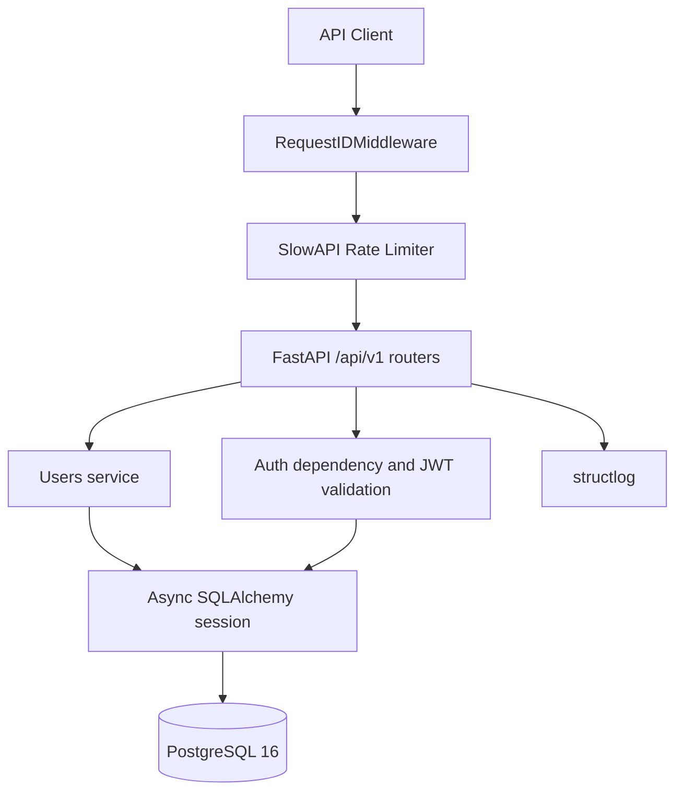

The backend uses a vertical module structure: each domain module owns its SQLAlchemy model, Pydantic schemas, service functions, and router. Shared concerns such as configuration, security, logging, database sessions, and middleware live in `app/core` and `app/db`.

## 🔄 Request Flow

### Login

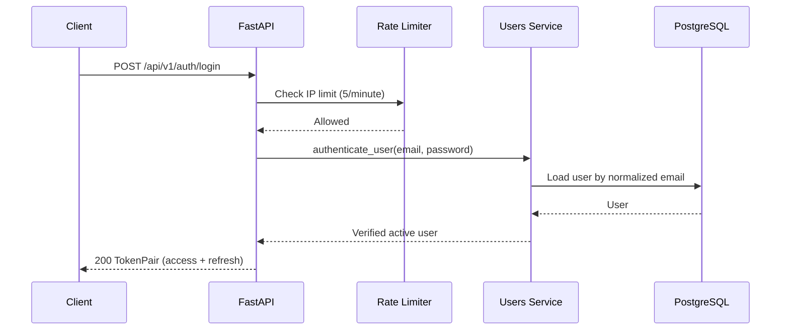

### Refresh

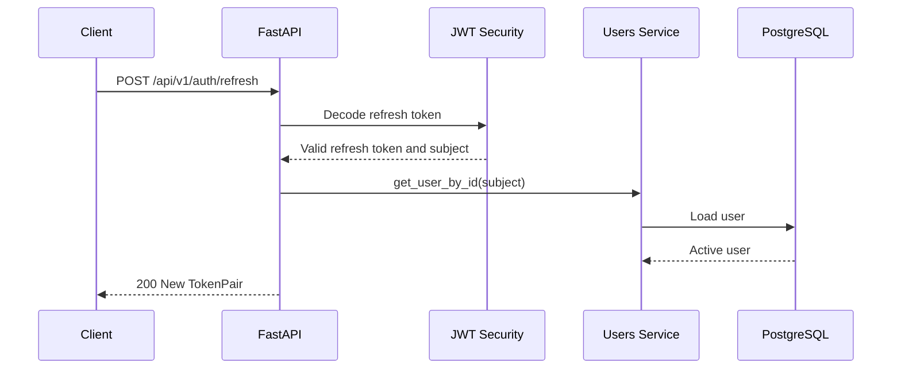

## 🛠️ Tech Stack

| Area | Technology |
| --- | --- |
| Language | [Python 3.13](https://www.python.org/) |
| API | [FastAPI](https://fastapi.tiangolo.com/) |
| Validation | [Pydantic v2](https://docs.pydantic.dev/) and [pydantic-settings](https://docs.pydantic.dev/latest/concepts/pydantic_settings/) |
| ORM | [SQLAlchemy 2.0](https://www.sqlalchemy.org/) async |
| Database | [PostgreSQL 16](https://www.postgresql.org/) with [asyncpg](https://magicstack.github.io/asyncpg/) |
| Migrations | [Alembic](https://alembic.sqlalchemy.org/) |
| Authentication | [PyJWT](https://pyjwt.readthedocs.io/) and [pwdlib](https://frankie567.github.io/pwdlib/) with Argon2 |
| Rate limiting | [SlowAPI](https://slowapi.readthedocs.io/) |
| Logging | [structlog](https://www.structlog.org/) |
| Testing | [pytest](https://docs.pytest.org/), [pytest-asyncio](https://pytest-asyncio.readthedocs.io/), [Testcontainers](https://testcontainers.com/), [httpx](https://www.python-httpx.org/) |
| Tooling | [uv](https://docs.astral.sh/uv/), [Ruff](https://docs.astral.sh/ruff/), [mypy](https://www.mypy-lang.org/) |
| Local infrastructure | [Docker](https://www.docker.com/) and Docker Compose |
| Hosting (frontend) | [Vercel](https://vercel.com/) — <https://felagi-crm.vercel.app> |
| Hosting (backend) | [Render](https://render.com/) — <https://felagi-crm.onrender.com> |
| Database (production) | [Neon](https://neon.tech/) serverless PostgreSQL |
| Keep-alive | [cron-job.org](https://cron-job.org/) pings `/api/v1/health` every 15 minutes |

## 💻 Frontend

A single-page application that consumes the API: an authenticated dashboard, full client and deal management, and a task board with drag-and-drop. See [frontend/README.md](frontend/README.md) for setup details.

### Frontend stack

| Area | Technology |
| --- | --- |
| Language | [TypeScript 5.9](https://www.typescriptlang.org/) (strict, no `any`) |
| UI library | [React 19](https://react.dev/) |
| Build tool | [Vite 8](https://vite.dev/) |
| Styling | [Tailwind CSS 4](https://tailwindcss.com/) with design tokens in `src/index.css` |
| Components | [shadcn/ui](https://ui.shadcn.com/) on [Base UI](https://base-ui.com/) |
| Routing | [React Router 7](https://reactrouter.com/) with lazy-loaded routes |
| Server state | [TanStack Query 5](https://tanstack.com/query) |
| Client state | [Zustand 5](https://zustand.docs.pmnd.rs/) with `persist` for auth and settings |
| HTTP | [Axios](https://axios-http.com/) with auth and refresh interceptors |
| Forms | [React Hook Form](https://react-hook-form.com/) and [Zod 4](https://zod.dev/) |
| Charts | [Recharts 3](https://recharts.org/) |
| Drag and drop | [dnd-kit](https://dndkit.com/) with pointer and keyboard sensors |
| Animation | [Framer Motion](https://motion.dev/) |
| Notifications | [Sonner](https://sonner.emilkowal.ski/) |
| Dates | [date-fns 4](https://date-fns.org/) with the `ru` locale |
| Testing | [Vitest 5](https://vitest.dev/) and [Testing Library](https://testing-library.com/) |

### Screens

| Task board (kanban) | Task list |
| --- | --- |
| 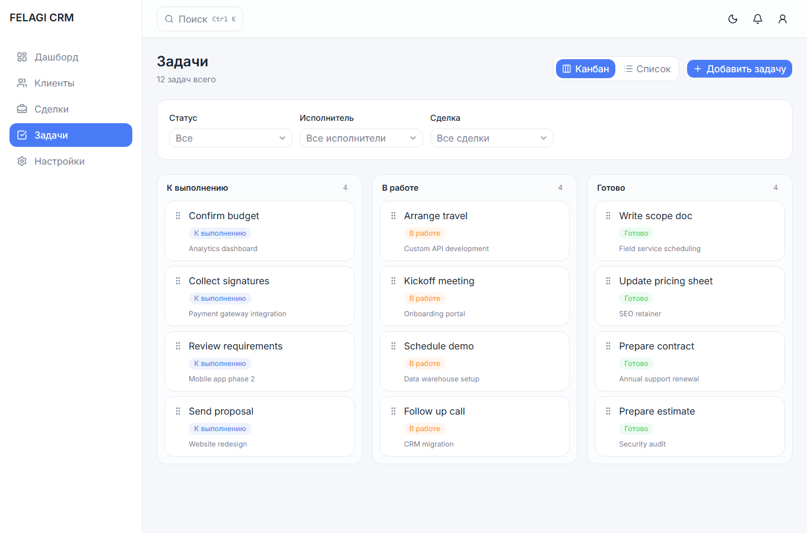 | 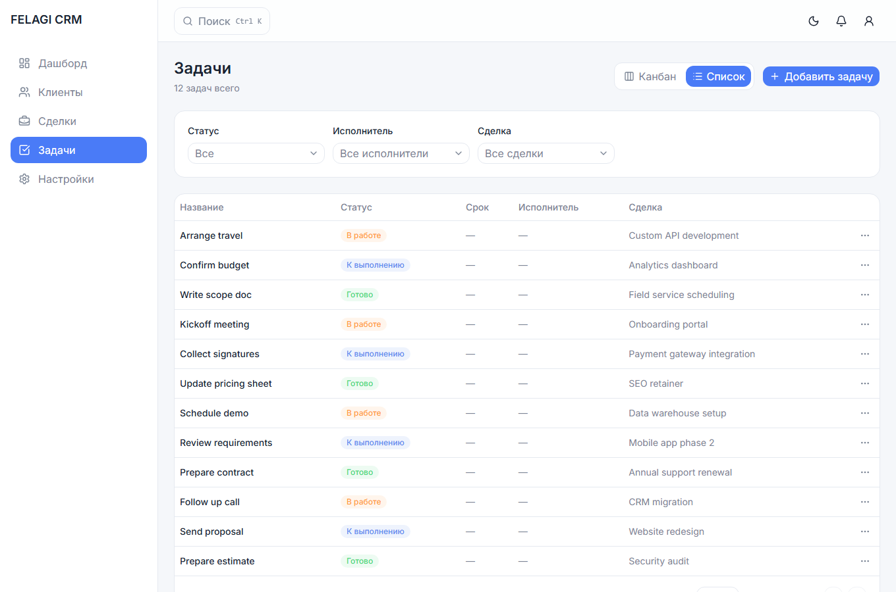 |

| Dashboard | Deals |
| --- | --- |
| 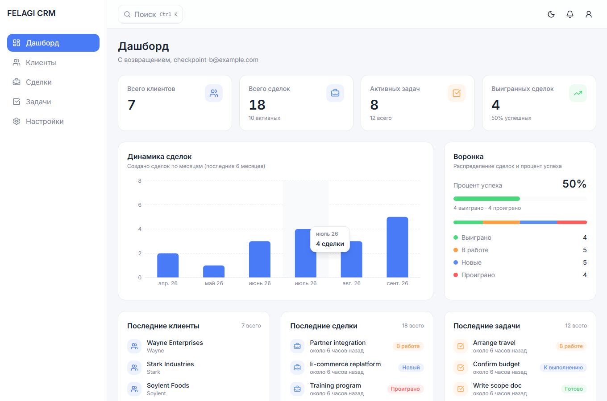 | 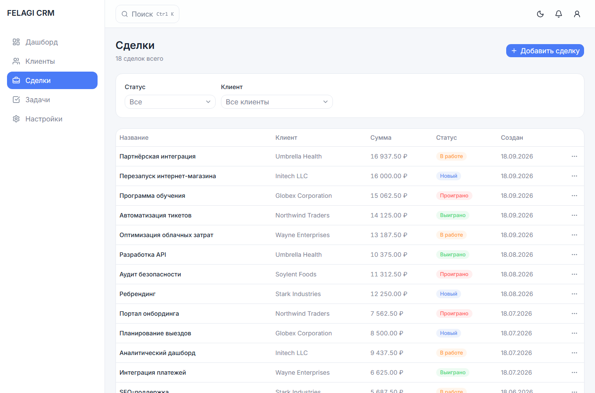 |

| Clients | Drag and drop |
| --- | --- |
| 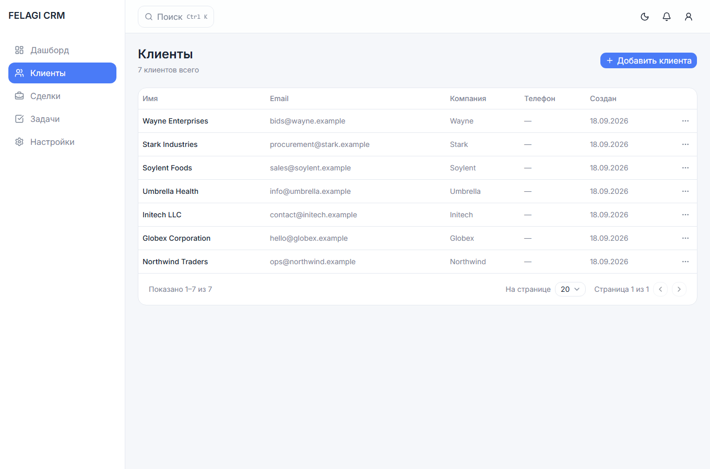 | 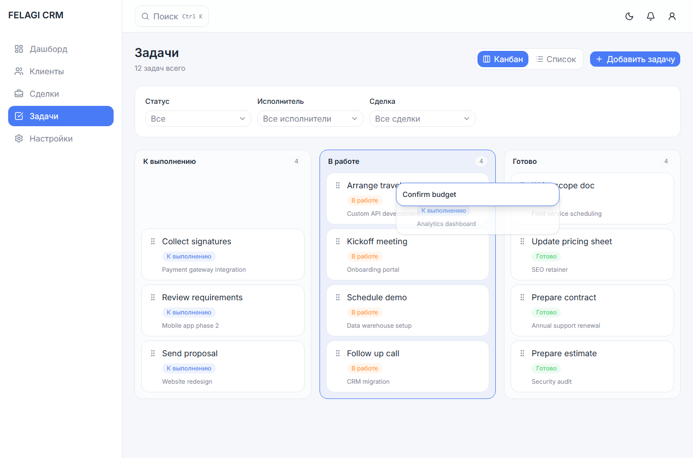 |

| New task | Settings and currency |
| --- | --- |
| 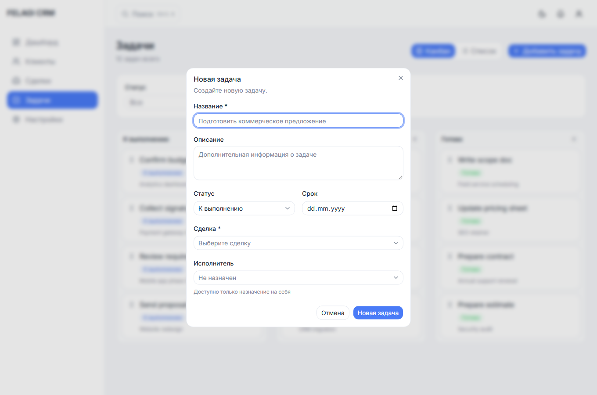 | 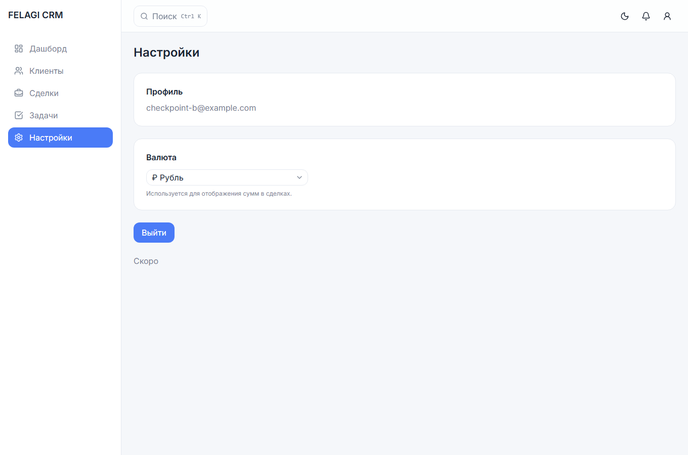 |

### Frontend quick start

The backend must be running first (`docker compose up`).

```text
cd frontend
npm install
npm run dev
```

Open <http://localhost:3000>. Vite proxies `/api` to `http://localhost:8000`, so no CORS setup is needed locally.

### Frontend commands

```text
npm run dev         # development server on port 3000
npm run build       # type-check and production build
npm run preview     # serve the production build
npm run typecheck   # tsc -b --noEmit
npm run lint        # eslint
npm run test        # vitest run
```

### Frontend notes

- **UI language is Russian.** All user-facing text lives in `src/lib/i18n.ts`; identifiers, comments, and API field values stay in English.
- **Collection endpoints need a trailing slash** (`/clients/`, not `/clients`). The bare path returns a 307 redirect that drops the `Authorization` header.
- **Money is handled as a string end to end.** The API serialises `Decimal` as a string, and it is never parsed into a JavaScript number, which would lose precision. The display currency is configurable in Settings (₽ / $ / €) and persisted in `localStorage`.
- **The bundle is code-split.** Each route is a lazy chunk, so Recharts ships only with the dashboard. The entry bundle is ~297 kB (96 kB gzip).
- **Kanban drag and drop supports the keyboard.** Focus a card's handle and use Space to pick up, arrow keys to move between columns, and Space to drop.

<a id="-frontend-testing"></a>

### Frontend testing

```text
cd frontend
npm run test
```

| Suite | Coverage |
| --- | --- |
| Schemas | Zod validation for auth, clients, deals, and tasks, including payload conversion |
| Queries | API client calls, query-string construction, cache invalidation, and optimistic updates |
| Dates and formatting | Russian date, relative-time, deadline-state, amount, and currency formatting |
| Stores | Auth and settings persistence in `localStorage` |
| Permissions | Role checks and per-task ownership rules |

The frontend suite has **194 passing tests** across 15 files.

## 📁 Project Structure

```text
app/
├── api/
│   ├── dependencies/       # Authentication dependencies
│   └── v1/                 # API v1 router and health endpoint
├── core/                   # Settings, JWT, logging, middleware, rate limits
├── db/                     # Declarative Base, async engine, session dependency
├── modules/                # users, clients, deals, and tasks domains
├── factory.py              # FastAPI app factory and middleware registration
└── main.py                 # ASGI entry point

alembic/
├── env.py                  # Async Alembic configuration
└── versions/               # Schema migrations

tests/
├── unit/                   # Password and JWT helper tests
├── integration/            # Auth API tests against Testcontainers PostgreSQL
└── conftest.py             # Database, app, client, and cleanup fixtures

frontend/
├── src/
│   ├── app/                # Router with lazy-loaded routes
│   ├── components/         # Layout, shared UI primitives, and common widgets
│   ├── features/           # auth, dashboard, clients, deals, tasks, settings
│   ├── lib/                # API client, i18n dictionary, formatters, permissions
│   ├── pages/              # Route-level screens
│   └── types/              # API types mirroring the backend schemas
└── tests/                  # Vitest suites and shared factories
```

## 🚀 Quick Start

### Docker

1. Copy `.env.example` to `.env` and set local secrets:

   ```text
   POSTGRES_PASSWORD=devpass
   JWT_SECRET_KEY=dev-secret-key-at-least-32-characters
   ```

2. Start the API and PostgreSQL:

   ```text
   docker compose up --build
   ```

3. Check the service:

   ```text
   curl http://localhost:8000/api/v1/health
   ```

   Expected response:

   ```json
   {"status":"ok","database":"ok"}
   ```

4. Stop services and remove the database volume:

   ```text
   docker compose down -v
   ```

### Without Docker

1. Install dependencies:

   ```text
   uv sync
   ```

2. Create `.env` with a local PostgreSQL configuration and JWT secret.
3. Start PostgreSQL 16.
4. Start the API:

   ```text
   uv run uvicorn app.main:app --reload
   ```

5. Visit `http://localhost:8000/api/v1/health`.

## 📚 API Endpoints

### System

| Method | Endpoint | Description | Authentication |
| --- | --- | --- | --- |
| `GET` | `/api/v1/health` | Database health check | No |

### Authentication

| Method | Endpoint | Description | Authentication |
| --- | --- | --- | --- |
| `POST` | `/api/v1/auth/register` | Register a user | No |
| `POST` | `/api/v1/auth/login` | Get an access/refresh token pair | No |
| `POST` | `/api/v1/auth/refresh` | Get a new token pair from a refresh token | No |

### Users

| Method | Endpoint | Description | Authentication |
| --- | --- | --- | --- |
| `GET` | `/api/v1/users/me` | Get the current user | Bearer access token |

### Clients

| Method | Endpoint | Description | Authentication |
| --- | --- | --- | --- |
| `POST` | `/api/v1/clients` | Create a client | Admin, manager |
| `GET` | `/api/v1/clients` | List clients (paginated) | All authenticated |
| `GET` | `/api/v1/clients/{id}` | Get a client | All authenticated |
| `PATCH` | `/api/v1/clients/{id}` | Update a client | Admin, manager |
| `DELETE` | `/api/v1/clients/{id}` | Delete a client; `409` if it has deals | Admin, manager |

### Deals

| Method | Endpoint | Description | Authentication |
| --- | --- | --- | --- |
| `POST` | `/api/v1/deals` | Create a deal | Admin, manager |
| `GET` | `/api/v1/deals?status=&client_id=` | List/filter deals (paginated) | All authenticated |
| `GET` | `/api/v1/deals/{id}` | Get a deal | All authenticated |
| `PATCH` | `/api/v1/deals/{id}` | Update a deal | Admin, manager |
| `DELETE` | `/api/v1/deals/{id}` | Delete a deal; cascades tasks | Admin, manager |

### Tasks

| Method | Endpoint | Description | Authentication |
| --- | --- | --- | --- |
| `POST` | `/api/v1/tasks` | Create a task; users can only self-assign | All authenticated |
| `GET` | `/api/v1/tasks?status=&assigned_to=&deal_id=` | List/filter tasks (paginated) | All authenticated |
| `GET` | `/api/v1/tasks/{id}` | Get a task | All authenticated |
| `PATCH` | `/api/v1/tasks/{id}` | Update a task | Admin/manager or assignee-user |
| `DELETE` | `/api/v1/tasks/{id}` | Delete a task | Admin/manager or assignee-user |

All list endpoints accept `limit` and `offset` and return `Page[T]`.

### Request and response examples

Register:

```json
{
  "email": "user@example.com",
  "password": "StrongPassword123"
}
```

The password must be 12–128 characters and contain a lowercase letter, an uppercase letter, and a digit. A successful registration returns `201 Created` with `UserRead`:

```json
{
  "id": "uuid",
  "email": "user@example.com",
  "role": "user",
  "is_active": true,
  "created_at": "2026-01-01T00:00:00Z"
}
```

Login returns `200 OK` with a token pair:

```json
{
  "access_token": "<jwt>",
  "refresh_token": "<jwt>",
  "token_type": "bearer"
}
```

`GET /api/v1/users/me` requires:

```text
Authorization: Bearer <access_token>
```

## 🔐 Auth & Authorization

### JWT tokens

| Token | Default TTL | Purpose |
| --- | --- | --- |
| Access | 15 minutes (`JWT_ACCESS_TOKEN_EXPIRE_MINUTES`) | Authenticate protected API requests |
| Refresh | 7 days (`JWT_REFRESH_TOKEN_EXPIRE_DAYS`) | Request a new access/refresh pair |

Both token types are signed JWTs and include a `token_type` claim. Access tokens cannot be used at refresh endpoints; refresh tokens cannot be used as Bearer credentials.

`POST /auth/refresh` returns a new access/refresh pair. This is JWT-only, non-revoking rotation: the prior refresh token remains valid until expiry because no server-side refresh-token store exists yet.

### Rate limiting

`POST /auth/register` and `POST /auth/login` allow **5 requests per minute per IP**. Exceeding the limit returns `429 Too Many Requests`.

### Roles

| Role | Clients | Deals | Tasks |
| --- | --- | --- | --- |
| `admin` | Full CRUD | Full CRUD | Full CRUD |
| `manager` | Full CRUD | Full CRUD | Full CRUD |
| `user` | Read-only | Read-only | Create (self-assign), update/delete own |

## 🧪 Testing

```text
uv run python -m pytest tests/ -q
```

| Suite | Coverage |
| --- | --- |
| Unit | Argon2 hashing and JWT creation, expiry, tampering, and token-type validation |
| Integration | Registration, CRM CRUD, filtering, pagination, refresh, `/users/me`, inactive users, duplicate emails, rate limiting, and RBAC matrix |

Integration tests use `Testcontainers` to run real PostgreSQL 16 and `httpx.AsyncClient` to exercise the ASGI application. The current suite has **141 passing tests** and **81% coverage** through `pytest-cov`. RBAC matrix tests cover admin, manager, and user permissions.

The frontend adds **194 passing tests** across 15 Vitest files (see [Frontend testing](#-frontend-testing)), bringing the project total to **335 tests**.

Additional quality checks:

```text
uv run python -m ruff check .
uv run python -m ruff format --check .
uv run python -m mypy app
```

For the frontend:

```text
cd frontend
npm run typecheck
npm run lint
npm run test
npm run build
```

## 🧠 Design Decisions

### UUID instead of integer IDs

UUIDs do not expose registration order or user count in public API responses, work naturally in distributed environments, and are generated in the application with `uuid4` without a PostgreSQL extension.

### `str` + `CHECK` instead of a PostgreSQL enum for roles

Roles are stored as a short string and constrained to `admin`, `manager`, and `user` with a database `CHECK`. The API remains strict with a Pydantic `Literal`, while adding future roles avoids PostgreSQL enum-type management.

### Lowercase normalization + `CHECK` instead of `citext` for email

Email is normalized to lowercase at the API boundary and constrained by `email = lower(email)` in PostgreSQL. A normal unique index then protects case-insensitive uniqueness without requiring the `citext` extension.

### `HTTPBearer` instead of `OAuth2PasswordBearer`

Login accepts a JSON request body rather than OAuth2 password-form data, and the current API does not use OAuth2 scopes. `HTTPBearer` describes the actual request contract and documents Bearer authentication in OpenAPI.

### JWT-only refresh rotation

Refresh returns a new pair for a consistent client flow, but previous refresh tokens are not revoked. Without a refresh-token table or another server-side store, revocation cannot be reliable; that state is intentionally deferred until it is needed.

### Testcontainers instead of database mocks

Integration tests exercise PostgreSQL constraints, Alembic migrations, async SQLAlchemy, and HTTP routing against a real disposable database. This covers failures that database mocks would miss.

### `token_type` claims in JWTs

Explicit `access` and `refresh` token types prevent accidental token substitution: refresh credentials are rejected by protected endpoints, while access tokens are rejected by `/auth/refresh`.

### ON DELETE strategies

Foreign keys use explicit deletion behavior: `RESTRICT` protects deals from deleting their client and preserves user creator history; `CASCADE` removes tasks when their parent deal is deleted; `SET NULL` keeps tasks when an assignee user is removed while clearing only the assignment.

### Decimal + `NUMERIC(12,2)` for amount

Deal amounts use Python `Decimal` and PostgreSQL `NUMERIC(12,2)`. Money does not tolerate binary floating-point rounding errors.

### Flat URLs

Tasks use the canonical `/tasks` route instead of nested `/deals/{id}/tasks`; callers filter by `deal_id` when needed, avoiding duplicate route semantics.

### Flat reads

Responses return foreign-key IDs rather than nested objects. This keeps payloads predictable and avoids accidental N+1 relationship loading.

### Broad RBAC in routers + object-level checks in services

Router dependencies enforce broad role permissions for Clients and Deals. Task ownership and self-assignment rules stay in the service layer, where the persisted object and current user are both available.

## 🗺️ Roadmap

- [x] **Stage 1 — Skeleton**
- [x] **Stage 2 — Users / Auth**
- [x] **Stage 3 — CRM Domain (clients, deals, tasks, RBAC)**
- [x] **Stage 4 — Frontend (auth, dashboard, clients, deals, tasks, Kanban, RBAC, i18n)**
- [x] **Stage 5 — Deploy (Vercel + Render + Neon)**
- [ ] **Stage 6 — Polish (monitoring, additional features)**

## 🌍 Environment Variables

| Variable | Required | Default | Description |
| --- | --- | --- | --- |
| `JWT_SECRET_KEY` | Yes | — | JWT signing key; use at least 32 characters |
| `JWT_ACCESS_TOKEN_EXPIRE_MINUTES` | No | `15` | Access token lifetime in minutes |
| `JWT_REFRESH_TOKEN_EXPIRE_DAYS` | No | `7` | Refresh token lifetime in days |
| `POSTGRES_SSL` | No | `false` | Use `false` locally and `true` for Render/Neon |
| `DATABASE_URL` | Conditional | — | Full async PostgreSQL URL; overrides individual `POSTGRES_*` values |
| `POSTGRES_DB` | No | `felagi_crm` | PostgreSQL database name |
| `POSTGRES_USER` | No | `felagi_crm` | PostgreSQL user |
| `POSTGRES_PASSWORD` | Conditional | — | Required unless `DATABASE_URL` is supplied |
| `POSTGRES_HOST` | No | `localhost` | PostgreSQL host |
| `POSTGRES_PORT` | No | `5432` | PostgreSQL port |
| `ENVIRONMENT` | No | `dev` | `dev`, `staging`, or `prod` |
| `DEBUG` | No | `false` | Enable SQLAlchemy debug logging |
| `LOG_LEVEL` | No | `INFO` | Application log level |
| `API_V1_PREFIX` | No | `/api/v1` | Versioned API path prefix |
| `CORS_ORIGINS` | No | `http://localhost:3000,http://localhost:3001` | Allowed frontend origins |

## 📝 License

Distributed under the MIT License.

## 📧 Author

[FELAGI0](https://github.com/FELAGI0)

---

Made with ❤️ using Python, FastAPI, and PostgreSQL
